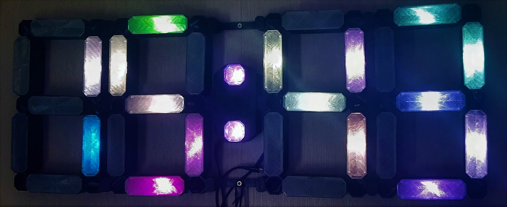
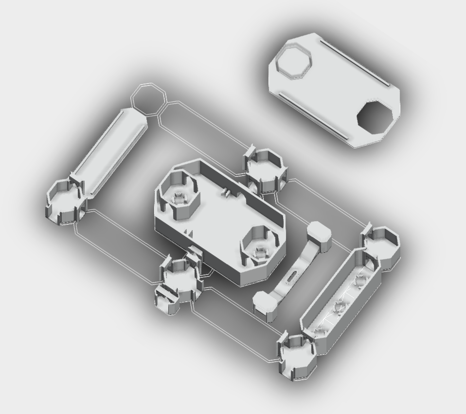

# RGB Wall Clock

### Table of content

- [Description EN](#description-pl)
- [Technologies](#technologies)
- [How start](#how-start)
- [Description PL](#description-pl)

### DESCRIPTION EN

Firmware to wall clock.
Clock display digits made with printed elements at 3d printer.
Each digit consist 7 segments and each includes one adressed power RGB LED.

Clock can show:
- current time
- current date
- relative humidity
- temperature

Display digits can get various colors:
- one color for all segments
- other color for each segment
- random color for all segment
- random color for each segment

Clock can configure for any time zone, and also can control brightnes of him.

Time can set manualy or synchronize with pick NTP server.
Clock have a WebREPL interface for upload Python scripts.

3D Models are in [3D MODELS](./3d_models/)
Dimmensioins of my clock: about 800x300 mm

### TECHNOLOGIES
 
- PYTHON: micropython, webrepl
- 3D Print

### HOW START

- Prepare your ESP to work with PYTHON scripts - [HELP](https://docs.micropython.org/en/latest/esp8266/tutorial/intro.html)
- In config.adres433 file you have to configure WiFi connection data.
- In webrepl_cfg.py file set webrepl pass
- In main.py set:
	- in line 11 SHT-30 sensor pin connection
	- in line 10 and 3 argument set pin to comunicate with diodes
- Upload to ESP and run.

### DESCRIPTION PL

Oprogramowanie układowe do zegara ściennego.
Cyfry wyświetlacza zegara wykonane z drukowanych elementów na drukarce 3d.
Każda cyfra składa się z 7 segmentów i każda zawiera jedną adresowaną diodę RGB mocy.

Zegar może pokazywać:
- Obecny czas
- bieżąca data
- wilgotność względna
- temperatura

Cyfry wyświetlacza mogą przybierać różne kolory:
- jeden kolor dla wszystkich segmentów
- inny kolor dla każdego segmentu
- losowy kolor dla wszystkich segmentów
- losowy kolor dla każdego segmentu

Zegar można skonfigurować dla dowolnej strefy czasowej, a także kontrolować jego jasność.

Czas można ustawić ręcznie lub zsynchronizować z wybranym serwerem NTP.
Zegar posiada interfejs WebREPL do przesyłania skryptów Pythona.

Modele 3d dostępne w katalogu [3D MODELS](./3d_models/)
Wymiary mojego zegara: ok. 800x300 mm